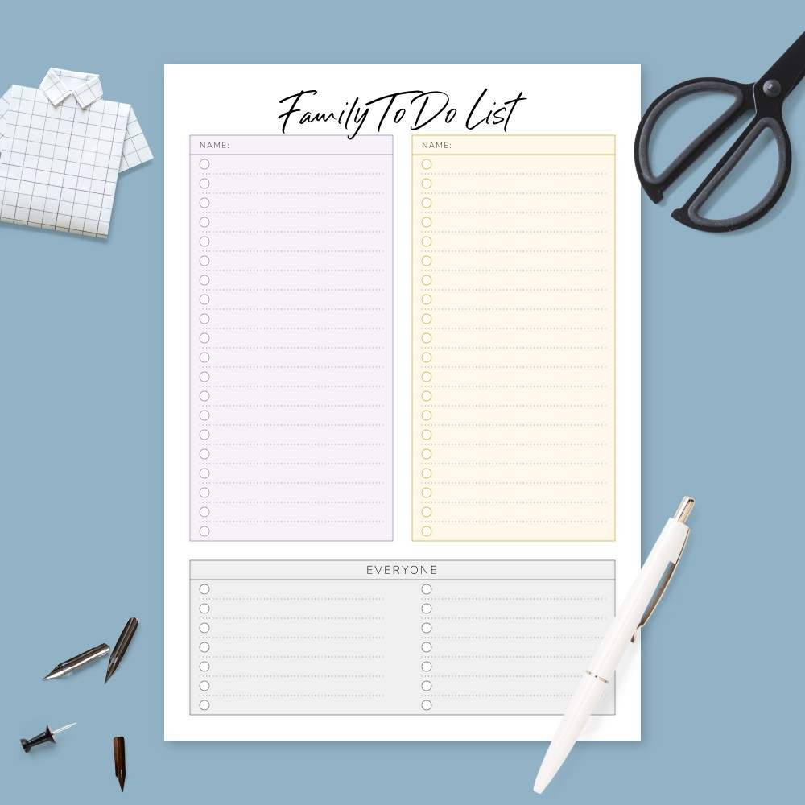

## Simple-todo-list 

### About the project:

### Task :bulb:

* Layout on JavaScript
* Mobile first
* Use modules
* Saving data in local storage
* Use destructorization

### Tools :hammer:

* HTML5
* Javascript
* Library Tailwind CSS

### Ready-made solution:

https://sergey-shar.github.io/todo-list/

